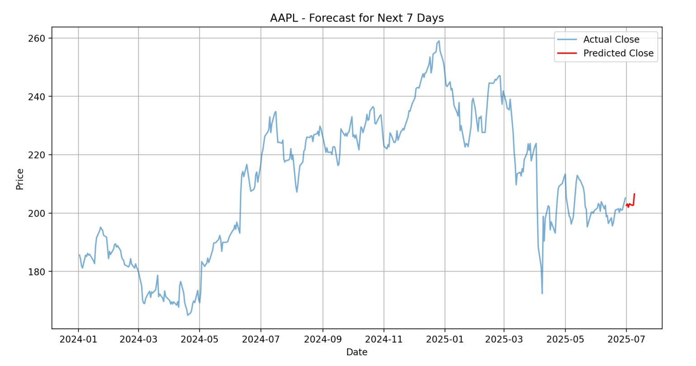
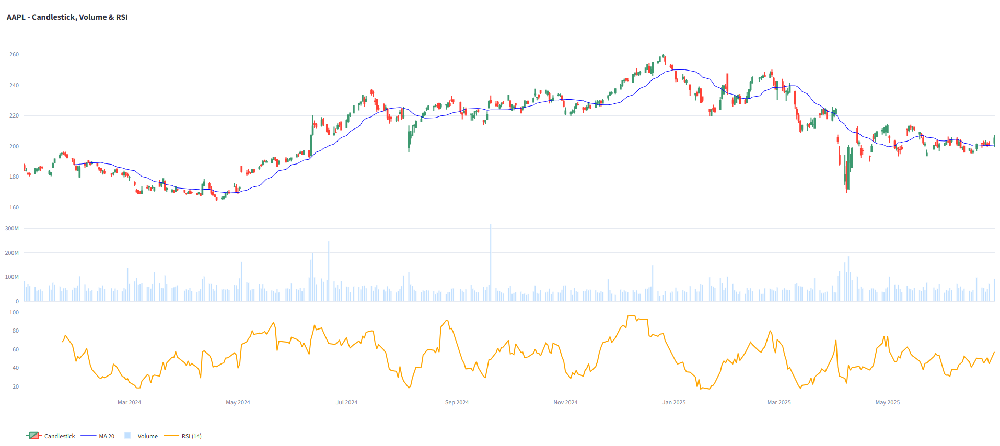

#  Stock Analyzer with ML Forecast

A Streamlit-based stock analysis app that fetches historical stock data from Alpha Vantage, calculates technical indicators (MA & RSI), and forecasts the next 7 days using machine learning (Linear Regression). Also includes interactive candlestick charts, volume, and RSI visualization using Plotly.

---

##  Live Demo

- Streamlit Cloud: [stock-analyzer-ml (Streamlit)](https://stock-analyzer-ml-9lbxrcgvkv6mrh7aqh7myf.streamlit.app/)

- Hugging Face: [HuggingFace Space](https://huggingface.co/spaces/mohdsaifcsu/app_stock_forecast)

- Railway: [stock-analyzer-ml (Railway)](https://stock-analyzer-ml.up.railway.app/)

(Note: You can use default Alpha Vantage key or enter your own for better reliability)_
---

##  Screenshots

| Forecast Output | Candlestick + RSI + Volume |
|-----------------|-----------------------------|
|  |  |

---

##  Features

- Fetches historical stock data via Alpha Vantage API
- Calculates:
  - 20-day Moving Average (MA)
  - Relative Strength Index (RSI)
- Forecasts next 7 days of closing prices using Linear Regression
- Interactive charts (Plotly):
  - Candlestick chart
  - Volume bar chart
  - RSI line chart
- Streamlit UI with user inputs for symbol, date range, and API key

---

##  How to Run Locally
##  Docker Support

###  1. Clone the repo

```bash
git clone https://github.com/your-username/stock-analyzer-app.git
cd stock-analyzer-app
```
## 2. Build the Docker image

```bash
docker build -t stock-analyzer-app .
```
## 3. Run the Docker container

```bash
docker run -d -p 8501:8501 stock-analyzer-app
```
## 4. Open in your browser

Visit: http://localhost:8501
